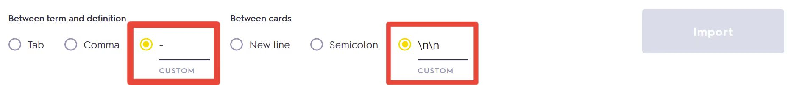
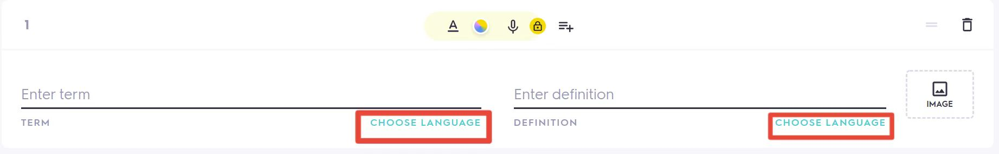

# GRE vocab schedule generator

A python script to generate vocabulary learning schedule using Ebbinghaus learning curve. Current vocab sets includes `GRE佛脚`, `GRE等价词汇`, `镇考3000`, and `镇考机经词汇`.

A sample study set, chosen `GRE佛脚`, `镇考3000`, and `镇考机经词汇` with 200 new words / day can found at [here](https://quizlet.com/Yucheng_Jiang6/folders/summer-2022-gre-vocab), and corresponding schedule can be found at [here](sample_schedule.md)

## Usage
Simply call `python schedule_generator.py` to create your study schedule. Sample input and output as follows,
```
python schedule_generator.py 
已读取单词书:
        (1) GRE佛脚
        (2) GRE等价词汇
        (3) 镇考3000
        (4) 镇考机经词汇
请选择单词书编号(逗号分割编号)： 1,3,4

已选择单词书： GRE佛脚 镇考3000 镇考机经词汇 

------------------计划数据生成------------------
请输入每日新增单词数量(1 ~ 4594)： 200
请输入开始日期（YYYY-mm-dd): 2022-05-16

从 2022-05-16 开始至 2022-06-27 结束，一共 43 天完成，单日最大复习词汇量 1400 
确认[y] / n ? y
---------------------------------------------
背单词计划以生成至路径./每日任务
```

## Schema

We define a **card** as the combination of **term + definition**. Term and definition should be separated by `-`, and **cards** should be separated by `\n\n`. 

This schema should be applied to all vocab lists and Quizlet import.


## Add vocab sets 

User can add more vocab sets than default sets by simply create a new directory. Inside that directory, make sure every vocab list file is of type `.txt` and follows the schema defined above


## Quizlet import

Default output directory `每日任务` is under the same directory `schedule_generator.py`. User need manually import each vocab list into quizlet manually using following steps

1. Create study set using [this url](https://quizlet.com/create-set)

2. Click `从Word、Excel、Google Docs等文件导入。` or `+ Import from Word, Excel, Google Docs, etc.`

3. Copy and paste vocab from one (or more) list

4. Modify `Between term and definition` to `-`, and modify `Between cards` to `\n\n`

   

5. Click `Import`

6. Click the first card, set `Term language` as `ENGLISH`, and set `Definition language` as `CHINESE (SIMPLIFIED)`

    

7. Finally, click `Create`
